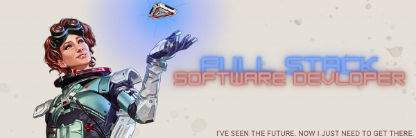

<h1>Glad You're Here!</h1>

### Welcome to my page! I'm Sarah, a fullstack developer currently living in Denver, Colorado. When I'm not coding or working, you can find me playing video games and playing with my dogs! I attended formal college starting in 2016. I have achieved an A.A. in general studies since then, but I decided to take a semester off and attend 4Geeks Academy for coding and decided to change my carreer path to Software Developing!
### Here are some fun facts about me
- 😍 I love frontend developing the most!
- 🌱 I’m always learning something new with coding 
- 👯 I’m looking to be a part of a great team of developers!
- 🥂 2023 Goals: Practice Python More!!
- ⚡ Fun fact: I love to play Apex any chance I can!
  
<h3>Technologies I Use</h3>

  
   
  
  
  
  
  
  
  
  
  
  
  
  
  
  
  
  

  
 <h2>Check Out My Github Stats</h2>

 
<h2></h2>

<h3>Where To Find Me</h3>

  

